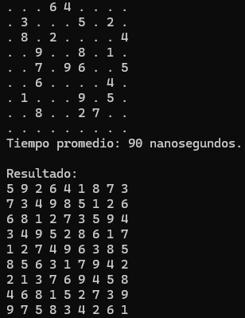

# Sudoku Solver - C++20 Optimizado

Solver de Sudokus de alto rendimiento con múltiples estrategias de backtracking y optimizaciones a nivel de compilador (PGO, LTO, `-march=native`).

## Estructura del Proyecto
- `src/main.cpp`: ...
- `include/`: Contiene diferentes versiones del algoritmo (sudoku_solver2.hpp la mejor)...
- `Makefile`: ...

## Requisitos
- Compilador: GCC 10+ o Clang 15+ (con soporte para `-fprofile-generate` y `-fprofile-use`).
- Sistema: Linux/macOS/WSL (con `time`). En Windows nativo, usar `Measure-Command`.

## Compilación
- `make`: Compila la versión optimizada (usa perfiles si existen, de lo contrario solo `-Ofast`).
- `make pgo`: **[Recomendado]** Realiza el ciclo completo de PGO. Entrenará el binario con `data.txt` y recompilará para exprimir el máximo rendimiento.
- `make clean`: Limpia el binario compilado.
- `make run`: Compila (si es necesario) y ejecuta el solver.

## Uso
Para resolver un Sudoku guardado en `data.txt`:
```bash
time ./bin/main < data.txt

```
## Ejemplo de un sudoku de dificultad extrema de [sudoku.com](https://sudoku.com/es/extreme/)

